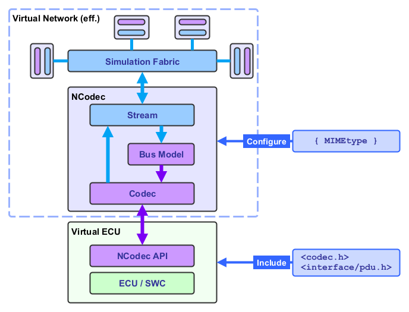

<!--
Copyright 2025 Robert Bosch GmbH

SPDX-License-Identifier: Apache-2.0
-->

# Dynamic Simulation Environment - Network Codec Library

[](https://github.com/boschglobal/dse.ncodec/actions/workflows/ci.yaml)
[](https://github.com/boschglobal/dse.ncodec/actions/workflows/super-linter.yml)


## Introduction

Network Codec Library (NCodec) of the Dynamic Simulation Environment (DSE) Core Platform.



__Codecs__: [AB Codec](#ab-codec)
<br/>
__Integrations__:
[DSE ModelC][dse_modelc] ([trace][dse_modelc_trace] code)
/ [DSE FMI][dse_fmi] (esp. FMI 2)
/ [DSE Network][dse_network]


### Project Structure

```text
dse.ncodec
└── doc/content         <-- Content for documentation systems
└── dse/ncodec
    └── codec/ab        <-- Automotive-Bus (AB) Codec implementation
        └── flexray     <-- FlexRay Bus Model implementation
    └── interface
        └── frame.h     <-- Frame based message interface
        └── pdu.h       <-- PDU based message interface
    └── stream
        └── buffer.h    <-- Buffer stream implementation
    └── codec.c         <-- NCodec API implementation
    └── codec.h         <-- NCodec API headers
└── extra               <-- Build infrastructure
└── licenses            <-- Third Party Licenses
└── tests               <-- Unit and E2E tests
```


## Usage

### Code Sample

```c
#include <dse/ncodec/codec.h>
#include <dse/ncodec/interface/pdu.h>
#define greeting "hello world"

void network_rxtx(NCODEC* nc) {
    /* Message RX. */
    while (1) {
        NCodecPdu pdu = {};
        if (ncodec_read(nc, &pdu) < 0) break;
        printf("(%u) message: %s", pdu.id, pdu.payload);
    }
    ncodec_truncate(nc); /* Clear the stream. */

    /* Message TX. */
    ncodec_write(nc, &(struct NCodecPdu){
        .id = 42,
        .payload = (uint8_t*)greeting,
        .payload_len = strlen(greeting) + 1,
        .transport_type = NCodecPduTransportTypeCan,
    });
    ncodec_flush(nc); /* Flush messages to the stream. */
}
```

More information about the NCodec API, including a complete example, is available in the [Network Codec API Reference](https://boschglobal.github.io/dse.doc/apis/ncodec/). Useful developer documentation relating to the DSE ModelC integration is available in the [Developer Documentation](https://boschglobal.github.io/dse.doc/docs/devel/ncodec/).


### CMake Build Integration

__CMakeLists.txt__
```cmake
# Fetch the NCodec code.
include(FetchContent)
FetchContent_Declare(dse_ncodec
    URL                 $ENV{DSE_NCODEC_URL}
    SOURCE_SUBDIR       dse/ncodec
)
FetchContent_MakeAvailable(dse_ncodec)

# Define a build target using the AB Codec (from the DSE NCodec library).
add_library(some_lib)
target_include_directories(some_lib
    PRIVATE
        ${dse_ncodec_SOURCE_DIR}
)
target_link_libraries(some_lib
    PUBLIC
        ab-codec
)
```

__Makefile__
```makefile
DSE_NCODEC_REPO ?= https://github.com/boschglobal/dse.ncodec
DSE_NCODEC_VERSION ?= 1.1.0
export DSE_NCODEC_URL ?= $(DSE_NCODEC_REPO)/archive/refs/tags/v$(DSE_NCODEC_VERSION).zip

.PHONY: build
build:
  $(MAKE) build-some_lib
```


## Codecs

### AB Codec

__MIME type__:  `application/x-automotive-bus; interface=stream;`


#### Feature Matrix

|  | PDU Interface | Frame Interface |
| :--- | :---: | :---: |
| Header | [interface/pdu.h][pdu_h] | [interface/frame.h][frame_h] |
| Stream | [stream/buffer.c][stream_buffer][^fmi2] |  [stream/buffer.c][stream_buffer][^fmi2] |
| Schema | [pdu.fbs][pdu_fbs] | [frame.fbs][frame_fbs] |
| Bus Models | supported | - |
| MIME type | `type=pdu; schema=fbs` | `type=frame; schema=fbs` |
| Language Support | C/C++ <br> Go <br> Python | C/C++ |
| Intergrations | [DSE ModelC][dse_modelc] <br> [DSE FMI][dse_fmi] | [DSE ModelC][dse_modelc] <br> [DSE FMI][dse_fmi] <br> [DSE Network][dse_network]  |


#### Network Support

| Bus / Network | PDU Interface | Frame Interface |
| :--- | :---: | :---: |
| CAN | &check; | &check; |
| FlexRay | &check; | - |
| IP (SomeIP/DoIP) | &check; | - |
| LIN | *[^lin] | - |
| PDU (Autosar Adaptive) | &check; | - |
| Struct (C-Structs) | &check; | - |


#### MIME type - Frame Interface

| Field | Type | Value (default) |  CAN |
| :--- | :---: | :---: | :---: |
| <var>bus_id</var>       | <code>uint8_t</code> | 1.. | &check;&check; |
| <var>node_id</var>      | <code>uint8_t</code> | 1.. | &check;&check;[^node_id] |
| <var>interface_id</var> | <code>uint8_t</code> | 0.. | &check; |


> [!NOTE]
> __&check;&check;__ indicates a required field. Other fields default to `0` or `NULL`.


#### MIME type - PDU Interface

| Field | Type | Value |  CAN | FlexRay | IP | PDU | Struct |
| :--- | :---: | :---: | :---: | :---: | :---: | :---: | :---: |
| <var>ecu_id</var>       | <code>uint8_t</code> | 1..                    | &check;&check; | &check;&check; | &check;&check; | &check;&check; | &check;&check; |
| <var>cc_id</var>        | <code>uint8_t</code> | 1..                    | - | &check; | - | - | - |
| <var>swc_id</var>       | <code>uint8_t</code> | 1..                    | &check;[^swc_id] | &check; | &check;[^swc_id] | &check;[^swc_id] | &check;[^swc_id] |
| <var>model</var>        | <code>string</code>  | `flexray`              |  - | &check;&check; | - | - | - |
| <var>pwr</var>          | <code>string</code>  | `on(default)\|off\|nc` |  - | &check; | - | - | - |
| <var>vcn</var>          | <code>uint8_t</code> | 0,1,2                  |  - | &check; | - | - | - |
| <var>poca</var>         | <code>uint8_t</code> | 1..9[^poc]             |  - | &check; | - | - | - |
| <var>pocb</var>         | <code>uint8_t</code> | 1..9[^poc]             |  - | &check; | - | - | - |


> [!NOTE]
> __&check;&check;__ indicates a required field. Other fields default to `0` or `NULL`.


## Build

```bash
# Get the repo.
$ git clone https://github.com/boschglobal/dse.ncodec.git
$ cd dse.ncodec

# Optionally set builder images.
$ export GCC_BUILDER_IMAGE=ghcr.io/boschglobal/dse-gcc-builder:main

# Build.
$ make

# Run tests.
$ make test

# Update source files (pull in changes).
$ make update

# Generate documentation.
$ make generate

# Remove (clean) temporary build artifacts.
$ make clean
$ make cleanall
```


## Contribute

Please refer to the [CONTRIBUTING.md](./CONTRIBUTING.md) file.


## License

Dynamic Simulation Environment Network Codec Library is open-sourced under the Apache-2.0 license.

See the [LICENSE](LICENSE) and [NOTICE](./NOTICE) files for details.


### Third Party Licenses

[Third Party Licenses](licenses/)


<!--- Schema Links --->
[frame_fbs]: https://github.com/boschglobal/automotive-bus-schema/blob/main/schemas/stream/frame.fbs
[pdu_fbs]: https://github.com/boschglobal/automotive-bus-schema/blob/main/schemas/stream/pdu.fbs

<!--- Code Links --->
[frame_h]: https://github.com/boschglobal/dse.ncodec/blob/main/dse/ncodec/interface/frame.h
[pdu_h]: https://github.com/boschglobal/dse.ncodec/blob/main/dse/ncodec/interface/pdu.h
[stream_buffer]: https://github.com/boschglobal/dse.ncodec/blob/main/dse/ncodec/stream/buffer.c
[stream_ascii85]: https://github.com/boschglobal/dse.ncodec/blob/main/dse/ncodec/stream/ascii85.c

<!--- Integration Links --->
[dse_modelc]: https://github.com/boschglobal/dse.modelc/blob/main/dse/modelc/model/ncodec.c
[dse_modelc_trace]: https://github.com/boschglobal/dse.modelc/blob/main/dse/modelc/model/trace.c
[dse_fmi]: https://github.com/boschglobal/dse.fmi/blob/main/dse/fmu/ncodec.c
[dse_network]: https://github.com/boschglobal/dse.network/blob/main/dse/network/encoder.c

<!--- Footnotes --->
[^lin]: LIN Support planned.

[^fmi2]: Via FMI 2 String Variables using ASCII85 encoding ([ascii85.c][stream_ascii85]).

[^poc]: Sets the initial POC State, e.g. 5 = NormalActive (see `NCodecPduFlexrayPocState` in [interface/pdu.h][pdu_h] for all POC states). Otherwise POC State is set by the FlexRay model according to its mode-of-operation.

[^swc_id]: Message filtering on `swc_id` (i.e. filter if Tx Node = Rx Node) is
only enabled when this parameter is set.

[^node_id]: Message filtering on `node_id` (i.e. filter if Tx Node = Rx Node) is
only enabled when this parameter is set.
