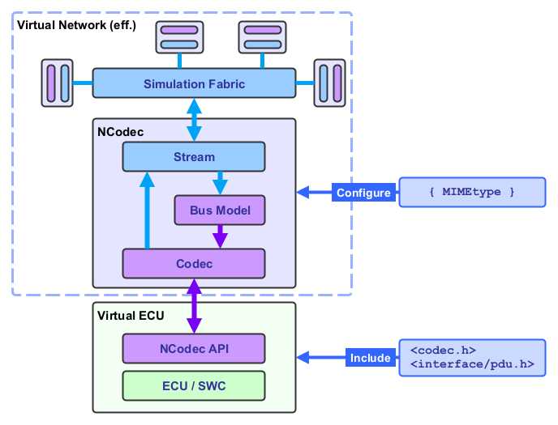

<!--
Copyright 2025 Robert Bosch GmbH

SPDX-License-Identifier: Apache-2.0
-->

# Dynamic Simulation Environment - Network Codec Library

[](https://github.com/boschglobal/dse.ncodec/actions/workflows/ci.yaml)
[](https://github.com/boschglobal/dse.ncodec/actions/workflows/super-linter.yml)


## Introduction

Network Codec Library (NCodec) of the Dynamic Simulation Environment (DSE) Core Platform.

NCodec provides C-based codecs and interfaces for exchanging network messages in simulations. It uses
a simple stream-based data exchange and can be configured with bus models to create high-fidelity
bus simulations. NCodec can be integrated directly from source code or loaded via a shared library.


__Codecs__: [AB Codec](#ab-codec) _(CAN/FlexRay/IP and PDU based networks)_
<br/>
__Bus Models__: [FlexRay](#mime-type---pdu-interface)
<br/>
__Integrations__:
[DSE ModelC][dse_modelc]
/ [DSE FMI][dse_fmi]
/ [DSE Network][dse_network]


### Contents

- [Usage](#usage)
  - [Code Sample](#code-sample-with-ab-codec)
  - [CMake Build Integration](#cmake-build-integration)
- [Codecs](#codecs)
  - [AB Codec](#ab-codec)
- [Build](#build)
  - [Package Layout](#package-layout)


### Project Structure

```text
dse.ncodec
├── doc/content             # Content for documentation systems
├── dse/ncodec
│   ├── codec/ab            # Automotive Bus (AB) codec implementation
│   │   ├── flexray/        # FlexRay bus model implementation
│   │   └── flexray_pop/    # FlexRay point-of-presence bus model implementation
│   ├── interface
│   │   ├── frame.h         # Frame-based message interface
│   │   └── pdu.h           # PDU-based message interface
│   ├── stream
│   │   └── buffer.h        # Buffer stream implementation
│   ├── codec.c             # NCodec API implementation
│   └── codec.h             # NCodec API headers
├── extra                   # Build infrastructure
├── licenses                # Third-party licenses
└── tests                   # Unit and end-to-end tests
```


## Usage

### Code Sample with AB Codec

> Note: Full example is available at [dse/ncodec/examples/ab-codec](dse/ncodec/examples/ab-codec)

```c
#include <dse/ncodec/codec.h>
#include <dse/ncodec/interface/pdu.h>
#include <dse/ncodec/stream/stream.h>

int cosim_step(NCODEC* nc)
{
    int rc = 0;

    /* Read PDUs from the NCodec. */
    for (;;) {
        NCodecPdu msg = {};
        CHECK_RC(ncodec_read(nc, &msg));
        if (rc == -ENOMSG) break;
        printf("Message is: %s\n", (char*)msg.payload);
    }
    CHECK_RC(ncodec_truncate(nc)); /* Always call _once_ per step. */

    /* Write PDUs to the NCodec. */
    CHECK_RC(ncodec_write(nc, &(struct NCodecPdu){
        .id = 42,
        .payload = (uint8_t*)greeting,
        .payload_len = strlen(greeting),
    }));
    CHECK_RC(ncodec_flush(nc)); /* Call after writing PDUs. */

    return 0;
}
```

More information about the NCodec API, including a complete example, is available in the [Network Codec API Reference](https://boschglobal.github.io/dse.doc/apis/ncodec/). Useful developer documentation relating to the DSE ModelC integration is available in the [Developer Documentation](https://boschglobal.github.io/dse.doc/docs/devel/ncodec/).


### CMake Build Integration

__CMakeLists.txt__
```cmake
include(FetchContent)
FetchContent_Declare(dse_ncodec
    URL           $ENV{DSE_NCODEC_URL}
    SOURCE_SUBDIR dse/ncodec
)
FetchContent_MakeAvailable(dse_ncodec)

add_library(some_lib)
target_include_directories(some_lib
    PRIVATE
        ${dse_ncodec_SOURCE_DIR}
)
target_link_libraries(some_lib
    PUBLIC
        ab-codec
)
```

__Makefile__
```makefile
DSE_NCODEC_REPO ?= https://github.com/boschglobal/dse.ncodec
DSE_NCODEC_VERSION ?= 1.1.0
export DSE_NCODEC_URL ?= $(DSE_NCODEC_REPO)/archive/refs/tags/v$(DSE_NCODEC_VERSION).zip

.PHONY: build
build:
    $(MAKE) build-some_lib
```

## Architecture




## Codecs

### AB Codec

__MIME type__:  `application/x-automotive-bus; interface=stream;`


#### Feature Matrix

|                  | PDU Interface                                    | Frame Interface                                                                  |
| :---             | :---:                                            | :---:                                                                            |
| Header           | [interface/pdu.h][pdu_h]                         | [interface/frame.h][frame_h]                                                     |
| Stream           | [stream/buffer.c][stream_buffer][^fmi2]          | [stream/buffer.c][stream_buffer][^fmi2]                                          |
| Schema           | [pdu.fbs][pdu_fbs]                               | [frame.fbs][frame_fbs]                                                           |
| Bus Models       | supported                                        | -                                                                                |
| MIME type        | `type=pdu; schema=fbs`                           | `type=frame; schema=fbs`                                                         |
| Language Support | C/C++ <br> Go <br> Python                        | C/C++                                                                            |
| Intergrations    | [DSE ModelC][dse_modelc] <br> [DSE FMI][dse_fmi] | [DSE ModelC][dse_modelc] <br> [DSE FMI][dse_fmi] <br> [DSE Network][dse_network] |
| Trace File       | enabled by env <br> `NCODEC_TRACE_PATH`[^trace] <br> `NCODEC_TRACE_PATH_<ecu>_<cc>_<swc>_`[^trace2]  |                                                                                  |


#### Network Support

| Bus / Network          | PDU Interface | Frame Interface |
| :---                   | :---:         | :---:           |
| CAN                    | &check;       | &check;         |
| FlexRay                | &check;       | -               |
| IP (SomeIP/DoIP)       | &check;       | -               |
| LIN                    | *[^lin]       | -               |
| PDU (Autosar Adaptive) | &check;       | -               |
| Struct (C-Structs)     | &check;       | -               |


#### MIME type - Frame Interface

| Field                   | Type                 | Value (default) | CAN                      |
| :---                    | :---:                | :---:           | :---:                    |
| <var>bus_id</var>       | <code>uint8_t</code> | 1..             | &check;&check;           |
| <var>node_id</var>      | <code>uint8_t</code> | 1..             | &check;&check;[^node_id] |
| <var>interface_id</var> | <code>uint8_t</code> | 0..             | &check;                  |


> [!NOTE]
> __&check;&check;__ indicates a required field. Other fields default to `0` or `NULL`.


#### MIME type - PDU Interface

| Field               | Type                 | Value                  |  CAN             | FlexRay        | IP               | PDU              | Struct           |
| :---                | :---:                | :---:                  | :---:            | :---:          | :---:            | :---:            | :---:            |
| <var>ecu_id</var>   | <code>uint8_t</code> | 0[^pop], 1..           | &check;&check;   | &check;&check; | &check;&check;   | &check;&check;   | &check;&check;   |
| <var>cc_id</var>    | <code>uint8_t</code> | 0 \| 1                 | -                | &check;        | -                | -                | -                |
| <var>swc_id</var>   | <code>uint8_t</code> | 0..                    | &check;[^swc_id] | &check;        | &check;[^swc_id] | &check;[^swc_id] | &check;[^swc_id] |
| <var>name</var>     | <code>string</code>  |                        | &check;[^name]   | &check;[^name] | &check;[^name]   | &check;[^name]   | &check;[^name]   |
| <var>model</var>    | <code>string</code>  | `flexray`              | -                | &check;&check; | -                | -                | -                |
| <var>mode</var>     | <code>string</code>  | `pop`                  | -                | &check;        | -                | -                | -                |
| <var>pwr</var>      | <code>string</code>  | `on(default)\|off\|nc` | -                | &check;        | -                | -                | -                |
| <var>vcn</var>      | <code>uint8_t</code> | 0,1,2                  | -                | &check;        | -                | -                | -                |
| <var>poca</var>     | <code>uint8_t</code> | 1..9[^poc]             | -                | &check;        | -                | -                | -                |
| <var>pocb</var>     | <code>uint8_t</code> | 1..9[^poc]             | -                | &check;        | -                | -                | -                |
| <var>loopback</var> | <code>bool</code>    | 0(off),1(active)       | &check;          | &check;        | &check;          | &check;          | &check;          |


> [!NOTE]
> __&check;&check;__ indicates a required field. Other fields default to `0` or `NULL`.


## Build

```bash
# Clone the repository.
git clone https://github.com/boschglobal/dse.ncodec.git
cd dse.ncodec

# Optionally set builder images.
export GCC_BUILDER_IMAGE=ghcr.io/boschglobal/dse-gcc-builder:latest

# Build.
make

# Run tests.
make test

# Update source files.
make update

# Generate documentation.
make generate

# Clean build artifacts.
make clean
make cleanall
```


### Package Layout

The AB Codec install target is packaged under the following directory layout:

```text
build/_out/
├── abcodec/
│   ├── lib/
│   │   └── libabcodec.so   # AB Codec shared library
│   └── include/            # AB Codec headers
├── licenses/               # License files
└── doc/                    # Documentation.
```


## Contribute

Please refer to the [CONTRIBUTING.md](./CONTRIBUTING.md) file.


## License

Dynamic Simulation Environment Network Codec Library is open-sourced under the Apache-2.0 license.

See the [LICENSE](LICENSE) and [NOTICE](./NOTICE) files for details.


### Third Party Licenses

[Third Party Licenses](licenses/)


<!--- Schema Links --->
[frame_fbs]: https://github.com/boschglobal/automotive-bus-schema/blob/main/schemas/stream/frame.fbs
[pdu_fbs]: https://github.com/boschglobal/automotive-bus-schema/blob/main/schemas/stream/pdu.fbs

<!--- Code Links --->
[frame_h]: https://github.com/boschglobal/dse.ncodec/blob/main/dse/ncodec/interface/frame.h
[pdu_h]: https://github.com/boschglobal/dse.ncodec/blob/main/dse/ncodec/interface/pdu.h
[stream_buffer]: https://github.com/boschglobal/dse.ncodec/blob/main/dse/ncodec/stream/buffer.c
[stream_ascii85]: https://github.com/boschglobal/dse.ncodec/blob/main/dse/ncodec/stream/ascii85.c

<!--- Integration Links --->
[dse_modelc]: https://github.com/boschglobal/dse.modelc/blob/main/dse/modelc/model/ncodec.c
[dse_fmi]: https://github.com/boschglobal/dse.fmi/blob/main/dse/fmu/ncodec.c
[dse_network]: https://github.com/boschglobal/dse.network/blob/main/dse/network/encoder.c

<!--- Footnotes --->
[^lin]: LIN Support is planned.

[^fmi2]: Via FMI 2 String Variables using ASCII85 encoding ([ascii85.c][stream_ascii85]).

[^poc]: Sets the initial POC State, e.g. 5 = NormalActive (see `NCodecPduFlexrayPocState` in [interface/pdu.h][pdu_h] for all POC states). Otherwise POC State is set by the FlexRay model according to its mode of operation.

[^pop]: A value of 0 may only be configured for a Point of Presence (PoP) node (i.e. a Gateway model connecting a NCodec network to an external Virtual Bus).

[^swc_id]: Message filtering on `swc_id` (i.e. filter if Tx Node = Rx Node) is
only enabled when this parameter is set.

[^node_id]: Message filtering on `node_id` (i.e. filter if Tx Node = Rx Node) is
only enabled when this parameter is set.

[^name]: Name of the NCodec (optional). Used in logging and trace files.

[^trace]: Trace files are named `ncodec.<name>.bin`. If `name` is not set in the MIME type then `<ecu_id>-<cc_id>-<swc_id>` is used.

[^trace2]: When several NCodec objects operate in the same process use a targeted trace envar to enable a specific trace. Use `name`[^name] to adjust the trace file name.
