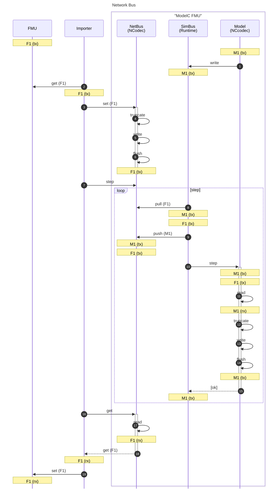
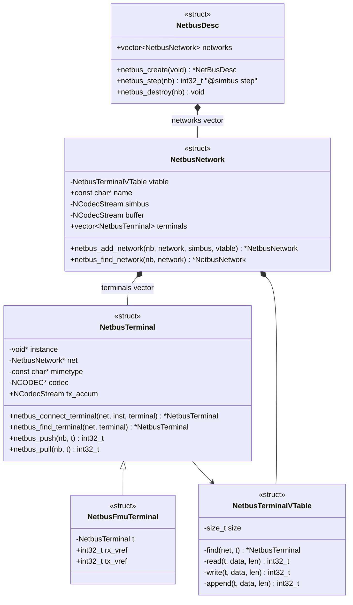
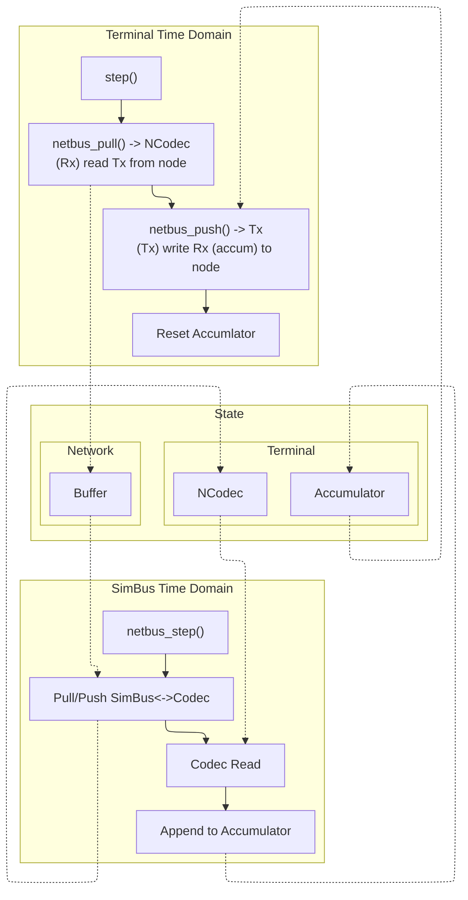

## Synopsis

A Network Bus is used to connect a network between a DSE SimBus Binary Signal, which may represent several Network Nodes, and any number of external (to the SimBus) Network Nodes. The Network Bus ensures that the operation of Network Codec objects, which represent connections to the Network, remains consistent when Bus Models are being operated (by the Network Codec).

## Design

### Sequence Diagram

### Class Diagram

### Data Flowchart

